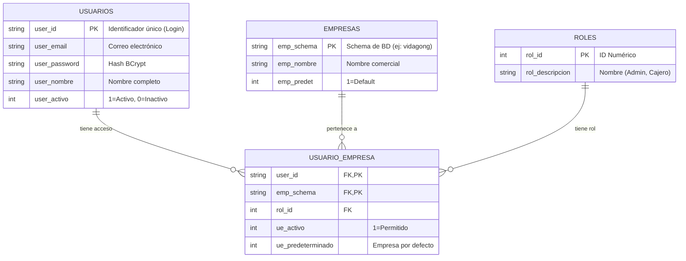

# Documentación del Esquema de Autenticación (`general`)

Este documento detalla las tablas creadas en el esquema `general` de PostgreSQL para manejar la autenticación multi-empresa.

## Diagrama de Relación

## Detalle de Tablas

### 1. `general.usuarios` (Usuarios Globales)
Almacena la identidad de la persona, independientemente de la empresa.
- **Propósito**: Permitir que un usuario inicie sesión en el sistema una sola vez.
- **Seguridad**: El campo `user_password` guarda un Hash Seguro (BCrypt), nunca texto plano.

### 2. `general.empresas` (Catálogo de Empresas)
Define qué empresas (tenants) existen en el sistema.
- **Propósito**: Mapear el nombre comercial con su esquema técnico en PostgreSQL (campo `emp_schema`).
- **Ejemplo**: `Vida Gong Catering` -> Schema `vidagong`.

### 3. `general.roles` (Roles del Sistema)
Catálogo de niveles de acceso disponibles.
- **Ejemplos**:
  - `1`: Administrador (Acceso total)
  - `2`: Usuario (Acceso limitado)

### 4. `general.usuario_empresa` (Relación Acceso)
Esta es la tabla clave del sistema multi-empresa.
- **Propósito**: Define **QUÉ** usuario puede entrar a **QUÉ** empresa y con **QUÉ** rol.
- **Flexibilidad**:
  - Un usuario (`juan`) puede ser **Administrador** en la empresa A.
  - El mismo usuario (`juan`) puede ser solo **Cajero** en la empresa B.
  - Y no tener acceso a la empresa C.

## Flujo de Login
Cuando alguien intenta loguearse:
1. El sistema verifica usuario y contraseña en `general.usuarios`.
2. Si es correcto, consulta `general.usuario_empresa` para ver a dónde puede entrar.
3. Retorna un Token que contiene el ID del usuario y la lista de empresas permitidas.
